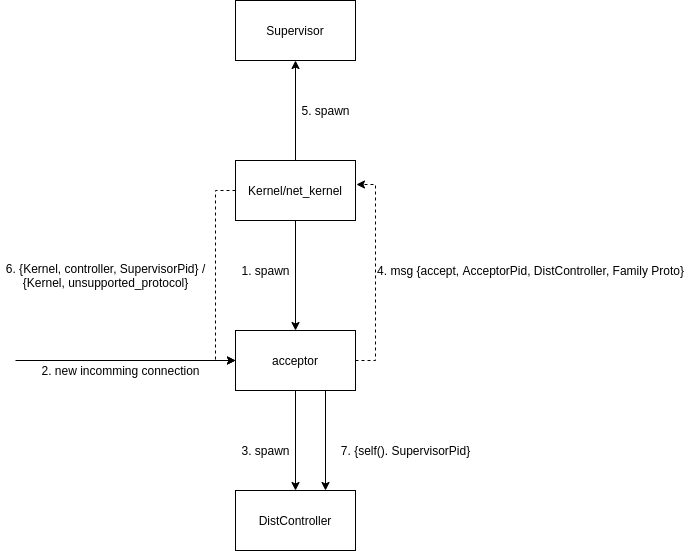

# qerldist

Erlang Distibution Protocol basing on QUIC.

## Build
    $ rebar3 compile

## Test

```
# shell 1

$ ERL_FLAGS="-proto_dist quic -no_epmd" rebar3 shell
1> net_kernel:start([node1, shortnames]).
```

```
# shell 2

$ ERL_FLAGS="-proto_dist quic -no_epmd" rebar3 shell
1> net_kernel:start([node2, shortnames]).

(node2@michal)2> net_adm:ping(node1@michal)
```

## Architecture



## Resources

#### Most important

* https://www.erlang.org/doc/apps/erts/alt_dist.html#distribution-module 
* https://github.com/erlang/otp/blob/OTP-24.2/lib/kernel/src/inet_tcp_dist.erl
* https://github.com/emqx/quic

#### Additional

* https://github.com/hauleth/consulate
* https://www.erlang.org/doc/apps/erts/erl_dist_protocol.html
* https://github.com/potatosalad/otp/pull/1
* https://erlangforums.com/t/rfc-erlang-dist-security-filtering-prototype/1002
